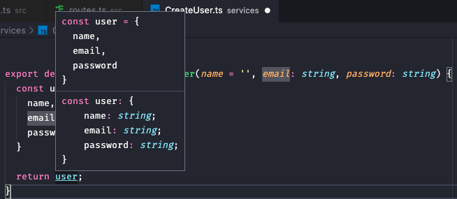
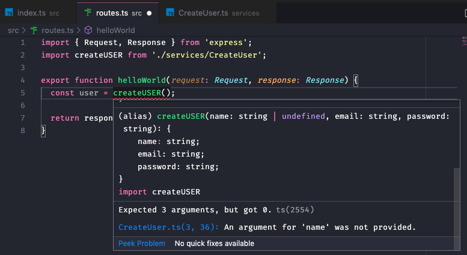
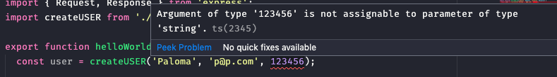
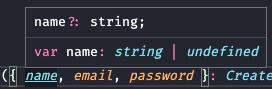
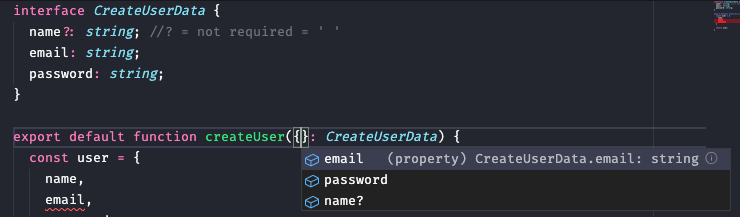

# README_TypeScript

[TypeScript](https://www.typescriptlang.org/index.html) is programming language, a strict syntactical superset of JavaScript, adds optional static typing to the language. It is a language that adds functionalities to Javascript.

It set rules that helps developers to standardize syntax and properties.

[Type system](https://en.wikipedia.org/wiki/Type_system) (tipagem) is a logical system comprising a set of rules that assigns a property called a type to the various constructs of a computer program, such as variables, expressions, functions or modules. These types formalize and enforce the otherwise implicit categories the programmer uses for algebraic data types, data structures, or other components (e.g. "string", "array of float", "function returning boolean"). The main purpose of a type system is to reduce possibilities for bugs in computer programs by defining interfaces between different parts of a computer program, and then checking that the parts have been connected in a consistent way. This checking can happen statically (at compile time), dynamically (at run time), or as a combination of both. Type systems have other purposes as well, such as expressing business rules, enabling certain compiler optimizations, allowing for multiple dispatch, providing a form of documentation, etc. 

- Configuring a project (for Node.js)
    1. create a folder > mkrdir typescript > `yarn init -y` > add Typescript `yarn add typescript -D` (in development environment because my code will need to  be already transformed in js before going to production)
    2. Create src folder then a index.ts file: `src/ index.ts`
    3. Add Express: `yarn add express` > `import express from 'express'` > `const app = express > app.listen(3333)`
    4. For InteliSense = auto-completing/ giving suggestions, VSC uses TypeScript underneath. But in .ts files you need to install each package from imported libraries. After importing Express, you will see "...":  '...express'. When hoover an information rectangle will appear telling you to either install the package or create your our type: 

        "

        Could not find a declaration file for module 'express'. '/Users/poliveira/Documents/Programming/goStack2020/typescript/node_modules/express/index.js' implicitly has an 'any' type.

        Try `npm install @types/express` if it exists or add a new declaration (.d.ts) file containing `declare module 'express';` > `add package: yarn add -D @types/express`

    5. Write a code

        ```jsx
        import express from 'express';

        const app = express();

        app.get('/', (request, response) => {
          return response.json({ message: 'Hello dear p' });
        })

        app.listen(3333);
        ```

    6. Run node server: yarn tsc pathForFile > `yarn tsc src/index.ts`
    7. TS will function almost like Babel, a transpilator, and will convert this code from .ts file in a Javascript code in a .js file. Open index.js file and you will see
    8. But an error may occur, because we need to configure this converter. Configure TS: >  `yarn tsc —init` . This will create a tsconfig.json file with lots of pre configuration
    9. Now we can run: `yarn tsc` to make the files convertion
    10. Now we can start node server from the convertes file (because node only understands js, not ts): `node src/index.js`
    11. Open localhost in the listen address: http://localhost:3333
    12. To avoid confusion, we can take this index.js file outside of the src folder
    13. And reconfigure the conversion path at `tsconfig.json file`: uncomment `"outDir": "./",` > create a directory to hold this conversions by giving a name for this path: `"outDir": "./dist"`
    14. Run `yarn tsc` and a directory with this name will be created. This directory will hold the exactly structure created at src folder. Files appears everytime yarn tsc runs

- When to add Types

    When we instal de @type package it comes with variables already defined and that creates a file .d.ts . We can acess this file by clicking `Cmd` and `clicking` in imported package, in this case, express. Cmd + click will also work for reading the definitions types used by this package

    When I use a direct  expression from the imported library it will understand it. But when I have another file and I am not using a direct component from the lib, than I need to define the Type. Example: 

    ```jsx
    import { Request, Response } from 'express';

    export function helloWorld(request: Request, response: Response) {
      return response.json({ message: 'discombobulateme, bitte' });
    ```

    here I have to say that request is a type Request

- Creating types for objects and vectors
    1. Create a folder services (isolated functions that execute a business rule and return a result) inside of src and a file with your function name `src/services/CreateUser.ts`
    2. Inside of CreateUser.ts file, create a simple function. You will see an error, some words underline in red. Passing the mouse over it tells you that there's no parameter: any. This is really bad, as js and ts must always know the parameters. You can also `Cmd + click` in the word to see more about it

        

    3. To tell the names what they are you can put " : " and tell if they are: a number, a string, a boolen, an object... `(name = '', email: string, password: string)` String can also just be " ' ' "
    4. After you tell if you will see it is all intersected, and the return of your function will already know what it need to return

        

    5. Now, when I import this function into another file without the proper arguments, TS will inform me what is missing: 

        

        It is expecting 3 arguments. If you don't know what it is talking about, you can click in the blue link and it will take you to the function file

    6. It will also show an error if instead of the pre determined argument (in the above case, a string) I give it another type: 

        

        It will say: I was expecting a string, not you

    7. It is a good practice also to desestructure no have a proper name for each argument. But to do it so, I need to use an Object, and than I can not attribute the parameter with " : ", I need an interface
    8. Interface. You create an object defining your types > than you add it into your function as an destructured object inside of the function: `createUser({name = '', email, password}: CreateUserData)` and attributes the interface to the whole object with " : " > (`{ } :CreateUserData`)

        ```jsx
        interface CreateUserData {
          name?: string; //? = not required = ' ' 
          email: string;
          password: string;
        }

        export default function createUser({name = '', email, password}: CreateUserData) {
          const user = {
            name, 
            email,
            password
          }

          return user;
        }
        ```

    9. About the ?: when I do this it means that I can, or not defined. In this case, I can add in my function an empty ' ' to leave as a string with default value, or just leave it without it and it will appear undefined

        

    10. Integration with ESLint in VSC allow us to know what needs to be inside of the function. If you Ctrl + Space inside of the empty { } it will show you your options, which are the ones of defined at interface

        

    11. What happens when my thing is an Array? Or accepts more than one thing?

        When it is a simple array, than , simple: `techs: string []` . But, when it is a more complex, another interface need to be created and added into the main object. 

        But you can have more than one value inside of each simple topic as well: `email: string | boolean;` meaning that email accepts a string or a boolean

        ```jsx
        interface TechObject {
          title: string;
          experience: number;
        }

        interface CreateUserData {
          name?: string; //? = not required = ' ' 
          email: string;
          //email: string | boolean;
          password: string;
          techs: Array<string | TechObject>;
          //techs: string [] 
        }
        ```